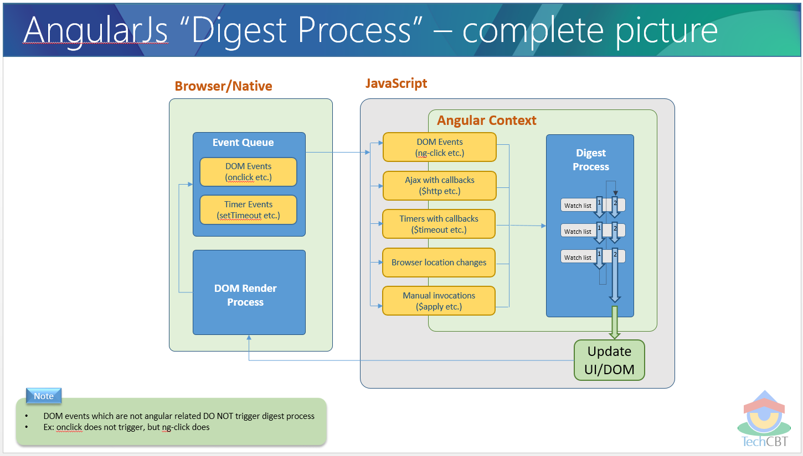

## Advanced AngularJS

看完以下部分，应当能回答这个问题：How data-binding works in AngularJS?

There is a lot of vocabulary around this: `$watch`, `$apply`, `$digest`, `$dirty-checking`.

浏览器和Angular中DOM和视图更新的先后顺序: callback代码执行完后再更新DOM。

Our browser is waiting for events, for example the user interactions.

If you click on a button or write into an input, the event's callback will run inside JavaScript and there you can do any DOM manipulation, so when the callback is done, the browser will make the appropriate change in the DOM.

Angular extends this events-loop creating something called `angular context`.  

Angular扩展了浏览器本身的event loop。

> Watches are not called periodically based on a timer.

dirty-checking: Angular checks if there are any changes to all the variables watched by all the $scope.

##### The $watch list

Every time you bind something in the UI you insert a `$watch` in a `$watch list`.

## $digest loop

When the browser receives an event that can be managed by the `angular context`, the `$digest` loop will be fired. 

Processes all the watchers of the current scope and its children.

Because a watcher's listener can change the model, the `$digest` keeps calling the watchers until no more listeners are firing.

This loop is made from two smaller loops. 

One processes the `$evalAsync` queue and the other one processes the `$watch` list.

When the `$digest loop` finishes, the DOM makes the changes.

> If you want to be notified whenever $digest is called, you can register a watchExpression function with no listener.

        $rootScope.$watch(function() {
            console.log('digest!');
        }); 
        
`$apply()` is used to execute an expression in AngularJS from outside of the AngularJS framework. 

For example from browser DOM events, setTimeout, XHR or third party libraries.

当自己写directive时，会常常需要用到$apply.
        
### When $digest cycle is called?

### $scope.$evalAsync() vs $timeout()

Sometimes, in an AngularJS application, you have to explicitly tell AngularJS when to initiate it's $digest lifecycle (for dirty-data checking).

Most of time, this can be easily accomplished with the $scope.$apply method.

However, some of the time, you have to defer the $apply() invocation because it may or may not conflict with an already-running $digest phase.

In those cases, you can use the $timeout service (which implicitly calls $apply() after a delay).

But, the $scope.$evalAsync() is likely to execute in the same tick of the JavaScript event loop.

[相关文章][1]        
[1]:https://www.bennadel.com/blog/2605-scope-evalasync-vs-timeout-in-angularjs.htm         

#### Compile vs Link
 
##### The compile phase
 
When the DOM is loaded Angular starts the compile phase, 
 

 

#### $parse

Advanced Angular

If you want to step up in your AngularJS knowledge, $parse is one of the most important services that you should know about.

Converts Angular expression into a function.

`$parse` takes an expression, and returns you a function.

#### 'this' vs $scope in AngularJS controller

- `this`: When the controller constructor function is called, `this` is the controller.

- `$scope`: Every controller has an associated `$scope` object. A controller (constructor) function is responsible for setting model properties and functions/behaviour on its associated `$scope`.

#### Kill $scope - Replace it with controllerAs

Controllers as we know them are class-like Objects that drive Modal and View changes, but they all seem to revolve around this mystical `$scope`.

运用controllerAs和this代替$scope.

我们为什么要这么做？

Class-like Object Pattern and Namespacing

看下面这个例子：

    

      <h1>{{name}}</h1>
      <modal>
        
{{name}}

      </modal>
    

    
在Angular1.2中加入的`controllerAs`语法，避免了上面这种情况，同时允许按下面这种方式书写controller。

    

        <h1>{{vm.name}}</h1>
    

        
    angular
    .module('someModule')
    .controller('someCtrl', function(){
      this.name = 'bill';
    });
    
实际上发生了什么：$scope下新增了一个对象vm，引用了该controller的实例。

