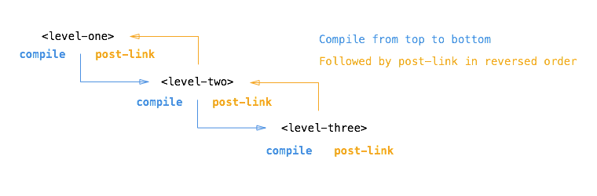

## Directives

为什么需要Directive?

Directive是AngularJS中一个非常强大的特性，但也十分令人困惑。

如何正确得去书写一个Directive?

Let's talk about the **API for registering directives**.

Much like controllers, directives are registered on modules.

To register a directive, you use the `module.directive` API.

`module.directive` takes the normalized directive name followed by a **factory function**.

This factory function should return 

        angular
            .module('moduleName')
            .directive('directiveName', function() {
              return {
                // DDO
              }
            })

At a high level, directives are markers on a DOM element (such as an attribute, element name or CSS class)

Similar to the terminology used when an element matches a selector, we say an element **matches** a directive。

`$compile` can match 

While creating directives, AngularJS allows you to create an `isolated scope` with some custom bindings to the parent scope.

These bindings are specified by the attribute defined in `HTML` and the definition of the `scope` property in the directive definition object.

There are 3 types of binding options

There are a few special events that AngularJS emits.

When a DOM node that has been compiled with Angular's compiler is destroyed, it emits a $destroy event.

### How ng-repeat works in AngularJS

ng-repeat executes at priority level 1000.

Implement my own version of ng-repeat:

          angular
            .module('moduleName')
            .directive('ngRepeat', function() {
              return {
                restrict: 'A',
                compile: function(tElement, tAttrs) {
                    // 通过正则解析tAttrs获得parent scope中相应array的标识符。
                    return function($scope, iElement, iAttrs) {
                        // watch相应array
                        $scope.$watchCollection();
                    }
              }
            })

### How directives are processed in AngularJS?

How AngularJS processes the element depends on the actual directive definition object.

有若干种情况需要考虑，这是最简单的情况：

        

另一种是内部包含子节点：

        

            

        

        
下面这种更为复杂：

         

            

         

Compile, Controller, post link , pre link <= 这些都是什么鬼？

Some directives such as `ng-repeat` clone DOM elements once for each item in a collection. 

Having a compile and link phase improves performance since the cloned template only needs to be compiled once, and then linked once for each clone instance.

所以分为compile和link仅仅是为了ng-repeat这类的directive？

`tElem` => template element

> If you create a directive that only has a link function, AngularJS treats the function as a post-link function. 

AngularJS provides an additional **hook**,

It's rare for directives to have a **compile function**, since most directives

Directive often have a **link function**.

A link function 

#### Template-expanding directive

可以实现HTML的复用，提高代码的可维护性和扩展性。

> Unless your template is very small, it's typically better to break it apart into its own HTML file and load it with the `templateUrl` option.

你可以register一个最简单的directive, 它的DDO中只有templateUrl，但这样的directive功能十分局限。

You need to create a different controller each time in order to re-use such a directive.

#### Isolating the Scope of a Directive

#### Creating a Directive that Wraps Other Elements

#### Creating Directives that Communicate

Sometimes it's desirable to be able to pass in an entire template rather than a string or an object.

To do this, we need to use the `transclude` option.

##### What is the difference between a source template and an instance template?

The fact that Angular allows DOM manipulation 

### Directive Definition Object

`priority`

When there are multiple directives defined on a single DOM element, sometimes it is necessary to specify the order in which the directive are applied.

下面这段话非常重要！

> The `priority` is used to sort the directives before their `compile` functions get called.

> Pre-link functions are also run in priority order, but post-link functions are run in reverse order. 

`bindToController`

This property is used to bind scope properties directly to the controller.

封装HTML和CSS并不是组件(component or directive)仅有的功能，它们也包含了逻辑，那么这些逻辑(function)处理的数据(params)又是来源于哪里呢？

`scope`

The scope property can be `false`, `true`, or an object.

- `false` (default): No scope will be created for the directive. The directive will use its parent's scope.

- `true`: A new 

- `{...}` (an object hash)

The 'isolate' 

The keys in the object hash map to the name of the property on the isolate scope;

子组件需要得到重新渲染

- `@` or `@attr` - bind 

  The result is always a string 

- `=` or `=attr` - set up a bidirectional binding between a local scope property and an expression passed via the attribute `attr`.

  The expression is evaluated in the context of the parent scope.
  
- `<` or `<attr` - set up a one-way(one-directional) binding between a local scope property and an expression passed via the attribute `attr`.

理论上，运用双向绑定，我们并不需要`&`，只不过同样的逻辑在父子组件中可能会重复出现。

- `&` or `&attr` - provides a way to execute an expression in the context of the parent scope.

    Often it's desirable to pass data from the isolated scope via an expression to the parent scope.
    
    就是说调用父组件的函数，但是参数值的解析是在子组件的scope当中。
    

All 4 kinds of bindings (`@`, `=`, `<` and `&`) can be made optional by adding `?` to the expression.

`compile`

        function compile($element, $attrs) { ... }

The compile function deals with transforming the template DOM.

Since most directives do not do template transformation, it is not used often.

The compile function takes the following arguments:

- `tElement` - 

A compile function can have a return value which can be either a function or an object.

- returning a (post-link) function - is equivalent to registering the linking function via the `link` property of the config object when the compile function is empty.

`controller`

Controller constructor function.

`require`

`link`

This property is used only if the `compile` property is not defined.

        function link($scope, $element, $attrs, controller) { ... }
        
- scope - The scope to be used by the directive for registering watches.
        
The link function is responsible for registering DOM listeners as well as updating the DOM.

It is executed after the template has been cloned.

This is where most of the directive logic will be put.

#### Transclusion

Transclusion is the process of extracting a collection of DOM elements from one part of the DOM elements and copying them to another part of the DOM, while maintaining their connection to the original AngularJS scope from where they were taken.

会有一个常见的需求：我们希望directive中的template是可以被扩充的，是动态的。

    <modal>
      <modal-body></modal-body>
      <modal-foot></modal-foot>
    </modal>
    
Transclusion is used (often with `ngTransclude`) to insert  