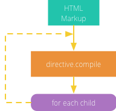
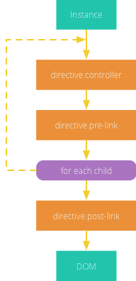

Why AngularJS?

HTML is great for declaring static documents, but it falters when we try to use it for declaring dynamic views in web-applications.

HTML本身是用来声明静态文档，在如今前后端分离，web-app的开发背景下，它显然无法很好的满足现有需求。

Model View Controller or MVC as it is popularly called, is a software design pattern for developing web application.

- Model - It is the lowest level of the pattern responsible for maintaining data.

- View - It is responsible for displaying all or a portion of the data to the user.

- Controller - It is a software Code that controls

我的理解是：在过去前后端不分离的开发背景下，动态的HTML是由后台生成的，数据的处理和填充也是后台完成的，前端JS只负责与DOM相关的操作。但在如今前后端分离的时代， 后台仅仅负责提供API，前端调用API获取数据、处理数据、填充数据，因此我们就需要一些传统的软件开发思想，如MVC，指导前端的开发过程。

ng1项目的目录结构：所有项目代码放在根目录的app文件夹下, 一些配置文件如package.json, bower.json等直接放在根目下。

angular-phonecat这个项目中并没有使用任何构建工具。

而用generator-gulp-angular生成的目录结构更适合实际项目，它使用了gulp作为构建工具。

在远古angular开发中，我们甚至会看到这样的代码，哈哈哈。

        

我们为什么需要前端路由？

在ng1中我们有angular-ui-router, 在vue中有vue-router.

AngularJS lets you extend HTML vocabulary for your application.

在angular和vue这样的框架中都涉及到一个bootstrap的问题，因为用这些框架写的html中都有一些具有特殊含义的语法，需要在浏览器渲染之前进行“编译”。

比如ng1中有很多特殊含义的directive，浏览器并不认识它们。

我们会有一个需求：根据某数组的内容去生成一个ul，数组的每一项分别填充如相应的li中。

在ng1中，directives和components的区别是什么？

据我了解，在ng1中，components这个概念是在后期版本 (1.5.x) 中引入的，因此这两个概念的功能本身就有重叠的部分。

##### ngApp

Use this directive to **auto-bootstrap** an AngularJS application.

The `ngApp` directive designates the **root element** of the application 

`ngApp`应当写在哪个html中：作为app入口的index.html中。

ngApp应当写在哪个标签上：`ngApp` is typically placed near the root element of the page: `<body>` or `<html>` tags.

### Conceptual Overview 

- Template: HTML with additional markup

- Model: the data shown to the user in the view and with which the user interacts

- Scope

- Controller: the business logic behind views

### Module

You can think of a module as a container for the different parts of your app - controllers, services, filters, directives, etc.

        // declare a module
        var myAppModule = angular.module( 'myApp', []);
        
那么在实际项目中，应该设置多少模块，这些模块之间的关系又是如何的？

### Controllers

Controllers在Angular中是非常重要的概念，它连接了model和view。

在Controllers中我们将获取到的数据展示到view当中。

In AngularJS, a Controller is defined by a JavaScript **constructor function** that is used to augment the AngularJS Scope.

When a Controller is attached to the DOM via the ng-controller directive,  AngularJS will instantiate a new Controller object,

A new **child scope** will be 

Use controllers to:

- Set up the initial state of the `$scope` object.
- Add behavior to the `$scope` object.

Do not use controllers to:

Typically, when you create an application you need to set up  

### Scopes

我们为什么需要scopes这个概念？

当有了数据，我们就需要对其进行管理，就会有作用域、命名空间等等概念。

Scopes provides APIs ($watch) to observe model mutations.

Scope

##### Integration with the browser event loop

1. The browser's event-loop waits for an event to arrive.

### Dependency Injection

在ng1的文档中，components这个概念有两个含义，一个是

在软件开发中，依赖是一个被广泛运用的概念。

Dependency Injection (DI) is a software design pattern deals with how components get hold of their dependencies.

The AngularJS **injector subsystem** is in charge of 

DI 

- Components such as services, directives, filters, and animations are defined by 

- Controllers are defined by a constructor function, which can be injected 

#### Dependency Annotation

### Interpolation

Interpolation markup with embedded expressions is used by AngularJS to provide data-binding to text nodes and attribute values.

        <a ng-href="img/{{username}}.jpg">Hello {{username}}!</a>
        

### Directives

ng-show/ng-hide和ng-if的差异？

不管是directives还是components，它们的作用都是将项目代码中重复部分提取出来，抽象成一个新的概念。

At a high level, directives are markers on a DOM element (such as an attribute, element name or CSS class)

Similar to the terminology used when an element matches a selector, we say an element **matches** a directive。

`$compile` can match 

Let's talk about the **API for registering directives**.

Much like controllers, directives are registered on modules.

While creating directives, AngularJS allows you to create an `isolated scope` with some custom bindings to the parent scope.

These bindings are specified by the attribute defined in `HTML` and the definition of the `scope` property in the directive definition object.

There are 3 types of binding options

There are a few special events that AngularJS emits.

When a DOM node that has been compiled with Angular's compiler is destroyed, it emits a $destroy event.

### Components

#### differences from directive

The `return {};` statement inside the `.directive()` becomes the Object definition inside `.component()`

##### Creating a Directive that Manipulates the DOM

Directives that want to modify the DOM typically use the `link` option to register

### Providers

Each web application you build is composed of objects

In AngularJS apps most of these objects are instantiated and wired together automatically by the **injector service**.

The injector creates two types of objects, **services** and **specialized objects**.

Services are objects whose API is defined by the developer writing the service.

Specialized objects conform to a specific AngularJS framework API. These objects are 

### HTML Compile

AngularJS's HTML compiler allows the developer to teach the browser new HTML syntax.

The compiler allows you to attach behavior to any HTML element or attribute and even create new HTML elements or attributes with custom behavior.

AngularJS calls these behavior extensions `directives`.

Compiler is an AngularJS service which traverses the DOM looking for attributes.

The compilation process happens in two phases: 

1. **Compile**:

1. `$compile` traverses the DOM and matches directives. (遍历、性能)

2.  Once all directives matching a DOM element have been 

3. `$compile` links the template 

A directive is just a function which executes 

在ng1中应当如何实现数据绑定？

In AngularJS applications, you move the job of filling page templates with data from the server to the client.

`$digest()`

Processes all of the watchers of the current scope and its children.

### Bootstrap

AngularJS initialization process and manually initialize AngularJS.

AngularJS initializes automatically的时间点。

##### $event

Directives like `ngClick` and `ngFocus` expose a `$event` object within the scope of that expression.

The object is an instance of a JQuery Event Object.

        <button ng-click="clickMe($event)">Event</button>

## Advanced AngularJS

看完以下部分，应当能回答这个问题：How data-binding works in AngularJS?

There is a lot of vocabulary around this: `$watch`, `$apply`, `$digest`, `$dirty-checking`.

浏览器和Angular中DOM和视图更新的先后顺序: callback代码执行完后再更新DOM。

Our browser is waiting for events, for example the user interactions.

If you click on a button or write into an input, the event's callback will run inside JavaScript and there you can do any DOM manipulation, so when the callback is done, the browser will make the appropriate change in the DOM.

Angular extends this events-loop creating something called `angular context`.  

Angular扩展了浏览器本身的event loop。

> Watches are not called periodically based on a timer.

##### The $watch list

Every time you bind something in the UI you insert a `$watch` in a `$watch list`.

##### $digest loop

When the browser receives an event that can be managed by the `angular context`, the `$digest` loop will be fired. This loop is made from two smaller loops. One processes the `$evalAsync` queue and the other one processes the `$watch` list.

When the `$digest loop` finishes, the DOM makes the changes.

> If you want to be notified whenever $digest is called, you can register a watchExpression function with no listener.

        $rootScope.$watch(function() {
          console.log('digest!');
        }); 

##### When angular does not use $apply for us

 #### Compile vs Link
 
 ##### The compile phase
 
 When the DOM is loaded Angular starts the compile phase, 
 
 
 
  

#### $parse

Advanced Angular

If you want to step up in your AngularJS knowledge, $parse is one of the most important services that you should know about.

Converts Angular expression into a function.

`$parse` takes an expression, and returns you a function.

##### $scope.$evalAsync() vs $timeout()

Sometimes, in an AngularJS application, you have to explicitly tell AngularJS when to initiate it's $digest lifecycle (for dirty-data checking).

Most of time, this can be easily accomplished with the $scope.$apply method.

However, some of the time, you have to defer the $apply() invocation because it may or may not conflict with an already-running $digest phase.

But, the $scope.$evalAsync() is likely to execute in the same tick of the JavaScript event loop.

        angular
            .module('demo', [])
            .directive('demoDirective', function() {
            
            

#### 'this' vs $scope in AngularJS controller

- `this`: When the controller constructor function is called, `this` is the controller.

- `$scope`: Every controller has an associated `$scope` object. A controller (constructor) function is responsible for setting model properties and functions/behaviour on its associated `$scope`.

#### Kill $scope - Replace it with controllerAs

前端项目常见需求

1：登陆系统，输入用户名密码，发起请求，获取token，存储在localstorage中，设置expire，当在app中一旦遇到401的错误，就自动登出，返回登陆页面。

2：用Ajax通过API获取数据，渲染到一个table中，然后提供修改、新增、删除的功能。

3：表单输入错误和提交时未填写完整的提示。

4：table中数据的懒加载。