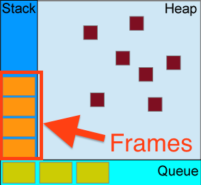

JavaScript是单线程的，也就是说，同一时间只能做一件事。

问题来了，为什么JavaScript不设计成多线程的呢？

这与它的用途有关，作为浏览器的脚本语言，JS的主要用途是与用户交互，更新DOM，发起请求等等。

但要注意的一点是，浏览器并不是单线程的！

所有任务可以分成两种，一种是同步任务(synchronous)，另一种是异步任务(asynchronous)。

同步任务指的是，在主线程上排队执行的任务，只有前一个任务执行完毕，才能执行后一个任务；异步任务指的是，不进入主线程、而进入“任务队列”(task queue)的任务，只有“任务队列”通知主线程，某个异步任务可以执行了，

主线程运行的时候，产生堆(heap)和栈(stack)，栈中的代码调用各种外部API

执行栈(Call Stack)中的代码（同步任务），总是在读取“任务队列”（异步任务）之前执行。

除了放置异步任务的事件，“任务队列”还可以放置定时事件，

        function test(i){
            return Promise.resolve().then(function() {
                    // update the DOM
                    document.getElementById('progress').innerHTML += i;
                    return i;
             });
        }
        
        var loadSequence = [];
        // loop through all the frames!
        for (var i = 0; i < 9999; i++) {
            loadSequence.push(test(i));
        }
        
        Promise.all(loadSequence).then(function(){
            window.console.log('all set...');
        });
        
改进的版本：
        
        function test(i){
            return Promise.resolve().then(function() {
                // update the DOM
                setTimeout(function() {
                    document.getElementById('progress').innerHTML += i;
                }, 0);
            return i;
          });
        }

A **JavaScript engine** is a program or an interpreter which executes JavaScript code.

The V8 Engine which is built by Google is open source and written in C++.

This engine is used inside Google Chrome.

V8 is also used for the popular Node.js runtime.

V8 was first designed to increase the performance of JavaScript execution inside web browsers.

事件驱动编程

In computer programming, **event-driven programming** is a programming paradigm in which the **flow of the program** is determined by events such as user actions ....

下面是一些和JavaScript运行机制有关的概念：

The following sections explain a theoretical model.

Modern JavaScript engines implement and optimize heavily the described semantics.

### Stack

栈

In computer science, a *stack* is an abstract data type that serves as a collection of elements, with two principal operations: push and pop.

运算受限的线性表，仅允许在表的一端进行插入和删除运算。

当我们调用一个函数，它的地址、参数、局部变量都会被压入到一个stack中。

Function calls form a stack of *frames*.

Each entry in the Call Stack is called a **Stack Frame**.

> This is exactly how stack traces are being constructed when an exception is being thrown.

浏览器中的主线程

### Heap

Objects are allocated in a heap which is just a name to denote a large mostly unstructured region of memory.

### Queue

队列是一种特殊的线性表，是一种先进先出(FIFO)的数据结构。

它只允许在表的前端进行删除操作，而在表的后端进行插入操作。

任务队列 消息队列

A JavaScript runtime contains a message queue, which is a list of messages to be processed.

A function is associated with each message.

You browser is one big infinite loop.

    while (queue.waitForMessage()) {
      queue.processNextMessage();
    }

`queue.waitForMessage` waits synchronously for a message to arrive if there is none currently.

##### Adding messages

In  web browsers, messages are added anytime an event occurs and there is 

It's waiting for you to do things all the time and, when you do, it fires off "Events" to describe what you just did.

Some events are generated by the user, like

You
    
##### Why We Need Asynchronous Behavior in the Browser

This asynchronous behavior is necessary because the kinds of events that JavaScript works with are often either time consuming (HTTP request) or highly intermittent

JavaScript is **single-threaded** yet it mimics the behavior of a multithreaded process by efficiently using its time 

The **Call Stack** contains the list of 

JavaScript has 

The *event loop* got

##### "Run-to-completion"

Each message is processed

JavaScript can only ever execute one piece of code at a time (due to its single-threaded nature). 

This means that when an asynchronous event occurs (like )

[示例][1]

[1]:https://jsfiddle.net/op3Lmkga/

### How JavaScript Timers Work

> In JavaScript, timer delay is not guaranteed.

The blue boxes represent portions of JavaScript being executed.

#### Microtasks and Macrotasks

It turns out that not all tasks are created the same.

There are macrotasks and microtasks.

