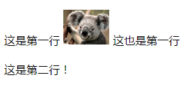

理解CSS的入口：

When laying out a document, the browser's rendering engine represents each element as a rectangular box according to the standard **CSS box model**.

在浏览器的渲染引擎渲染一个文档的过程中，每一个元素都被视作一个矩形的盒子。

Every box is composed of four parts (or areas).

每个盒子都由四部分或四个区域组成。

If the `box-sizing` property is set to *content-box*

`box-sizing`是非常重要的一个CSS属性。

A **block** on a webpage is an HTML element that appears on a new line, underneath the preceding element and above the following element.

问题1：当你在空白页面中放入一个块级元素，比如div，不设置任何CSS，它的height和width属性的值分别为多少？

问题2：以下两段代码的结果有什么区别？

        div {
            width: 100%;
            padding: 10px;
        }
        
        div {
           padding: 10px;
       }
       
问题3：如何实现宽度自适应按钮，即让按钮的其相对位置是如何的？大小自适应于文字的个数(不使用内置元素如span、button等等)？

一种方法是使用`display:inline-block`属性，另一种方法就是使用`float`属性。

浮动就是个带有方位的`display:inline-block`属性。

`display:inline-block`某种意义上的作用就是包裹(wrap)，而浮动也有类似的效果。

因此大多数类似于`display:block; float:left`这样的CSS都是不优雅的。

浮动最原始的意义就是用来让图片环绕文字。

`float`可以说是所有CSS属性中的“破坏之王”。

参考：

http://www.zhangxinxu.com/wordpress/2010/01/css-float%E6%B5%AE%E5%8A%A8%E7%9A%84%E6%B7%B1%E5%85%A5%E7%A0%94%E7%A9%B6%E3%80%81%E8%AF%A6%E8%A7%A3%E5%8F%8A%E6%8B%93%E5%B1%95%E4%B8%80/
       
问题4：什么是列表布局以及列表布局的实现方式？

所谓列表布局就是具有相同DOM结构、水平排列可以repeat出来的一列元素的布局方式

最古老的列表布局方式就是浮动布局。

元素内的文本节点属于匿名inline boxes。

问题5：当文本与图片位于同一行时，其相对位置是如何的？

默认情况下，图片与文字混排应该是这个样子：图片与文字基线对齐，图片与文字在同一行上。

The `line-height` CSS property sets the amount of space used for lines, such as in text.

On block-level elements, it specifies the minimum height of line boxes within the element.

On non-replaced inline elements, it specifies the height that is used to calculate line box height.

在目前CSS的世界里中，所有的高度都是由两个CSS模型产生的，一个是box盒状模型，对应CSS为"height+padding+margin"，另外一个是line box模型，对应样式为"line-height"。

问题6：三栏自适应布局有哪些实现方式？

http://www.zhangxinxu.com/wordpress/2009/11/%E6%88%91%E7%86%9F%E7%9F%A5%E7%9A%84%E4%B8%89%E7%A7%8D%E4%B8%89%E6%A0%8F%E7%BD%91%E9%A1%B5%E5%AE%BD%E5%BA%A6%E8%87%AA%E9%80%82%E5%BA%94%E5%B8%83%E5%B1%80%E6%96%B9%E6%B3%95/

问题7：如何实现比例固定图片自适应布局？

问题8：居中问题

我们可以使用*text-align*属性来居中行内元素。

The *text-align* CSS property describes how inline content like text is aligned in its parent block element.

*text-align* does not control the alignment of block elements, only their inline content.

问题9：如何将一张图片设置为某页面的背景？

每张图片都有自己的尺寸和比例，若不作任何设置，图片则会以原始比例作为页面背景，显示的区域大小由屏幕尺寸决定，这显然不是我们想要的。

The `background-size` CSS property specifies the size of the background image.

The size of the image can be fully constrained or only partially in 