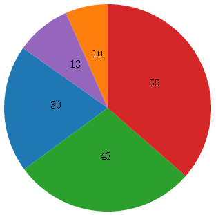

We could create path data ourselves but D3 can help us using functions known as generators.

## Line generator

D3's line generator produces a **path data string** given an **array of co-ordinates**.

Construct a line generator:

        var lineGenerator =  d3.line();
        
然后再调用line generator并传入数据(数组)，生成最终用于显示的数据:

        var pathData = lineGenerator(data);

## Pies

饼状图

假如我们有数据`[ 30 , 10 , 43 , 55 , 13 ]`，如何能实现上面的效果。

The units of angle are arbitrary, but if you plan to use the pie generator 

## Arcs

The arc 