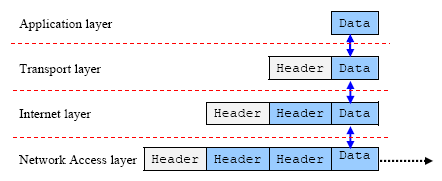

互联网中的设备是如何进行通信的？

TCP/IP参考模型

这个模型有5层：物理层、数据链路层、网络层、传输层和应用层。

Physical layer

物理层的作用是将比特从一台机器传输传输到另一台机器。

Link layer

数据链路层

比如以太网(Ethernet)和802.11都是数据链路层的协议。

Application layer

应用层

This is the layer in which all high level protocols, such as HTTP, SSH, FTP, WebSocket, operate.

Transport layer

传输层

如果把IP地址比作一间房子，端口就是出入这间房子的门。

端口通过端口号来标记，端口号是整数。

通过上图可以得知，端口号的范围为0到2的16次方减一之间的任意整数。

Internet layer

网络层

传输控制协议

The Transmission Control Protocol(TCP) is   

Transmission Control Protocol accepts data from a data stream,

每个分层中，都会对所发送的数据附加一个首部。

Every layer will encapsulate the appropriate header.

